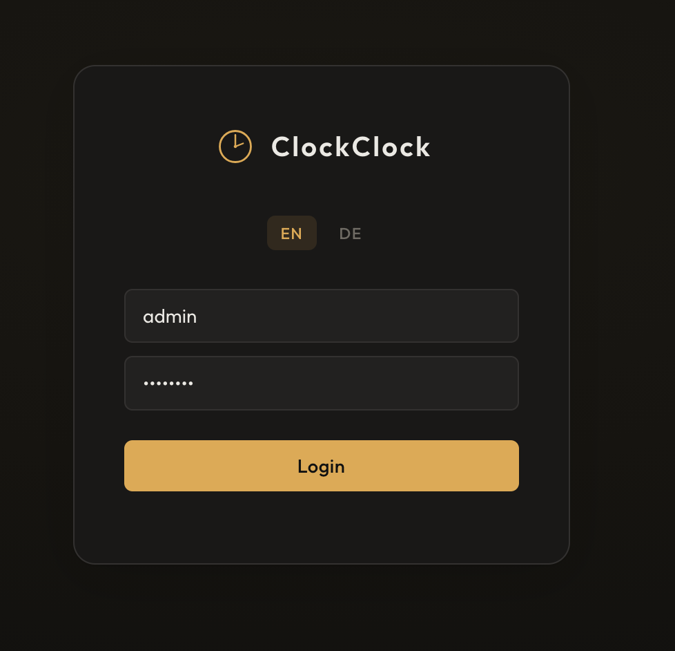
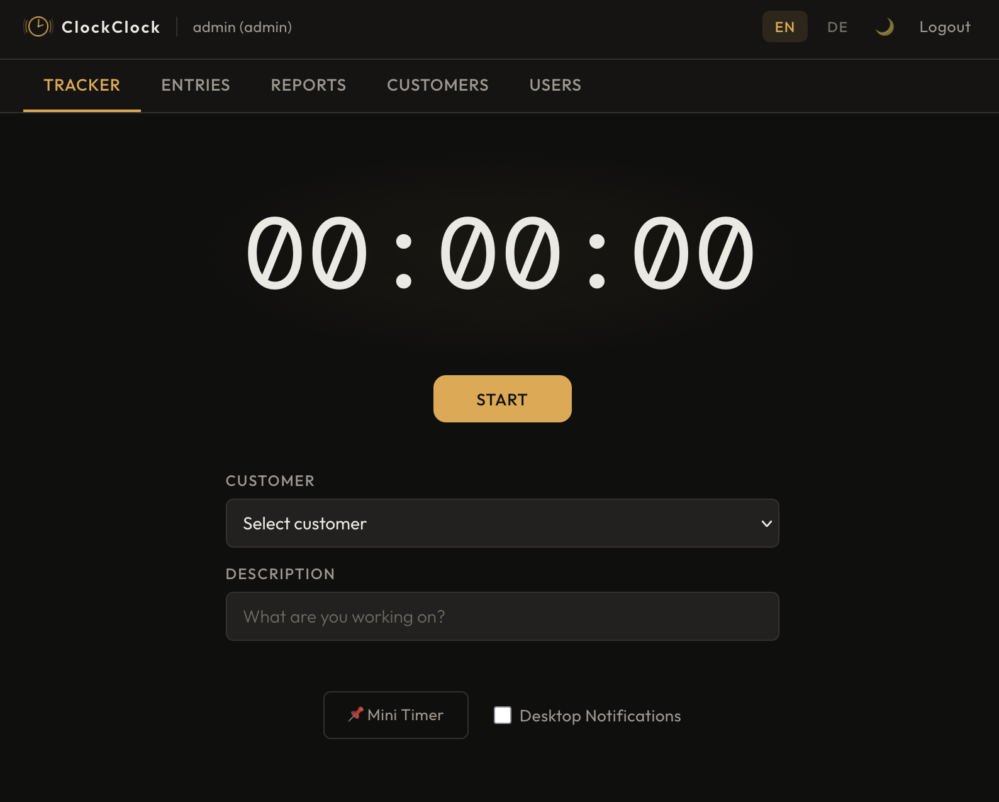
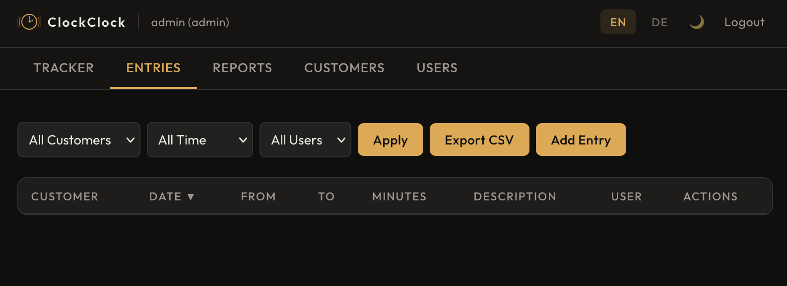
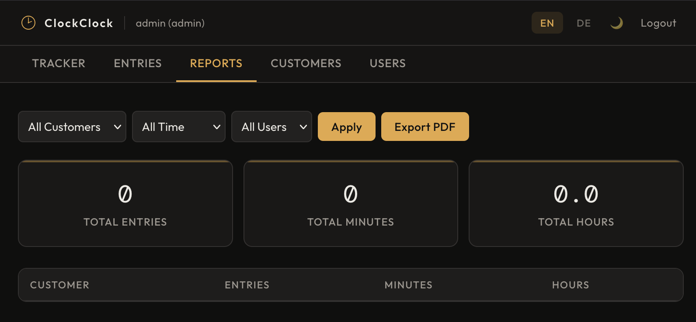
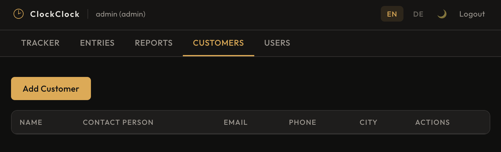
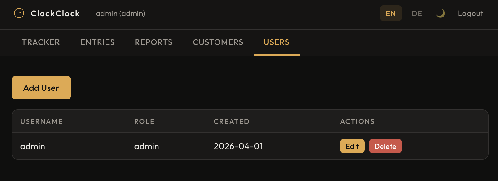

# ClockClock

**Simple, self-hosted time tracking for freelancers and small teams.**

Track billable hours across clients, export reports, and stay on top of your work — all from a clean web interface with no external services required.

---

## Screenshots

<table>
  <tr>
    <td align="center" width="33%">
      <br/>
      <b>Login</b><br/>
      <sub>Clean login screen with EN/DE language switcher. Supports local auth and OIDC/SSO. Login attempts are rate-limited.</sub>
    </td>
    <td align="center" width="33%">
      <br/>
      <b>Tracker</b><br/>
      <sub>Main timer view. Assign a customer, add a description, and start tracking. Timer survives page reloads via local storage. Includes a picture-in-picture mini window and optional desktop notifications.</sub>
    </td>
    <td align="center" width="33%">
      <br/>
      <b>Entries</b><br/>
      <sub>Full log of all time entries. Filter by customer, date range, or user. Admins see everyone's entries; users see only their own. Export to CSV or add entries manually.</sub>
    </td>
  </tr>
  <tr>
    <td align="center" width="33%">
      <br/>
      <b>Reports</b><br/>
      <sub>Aggregated summary showing total entries, minutes, and hours with a per-customer breakdown. Apply the same filters as Entries and export the result as a PDF.</sub>
    </td>
    <td align="center" width="33%">
      <br/>
      <b>Customers</b><br/>
      <sub>Manage your client list with full contact details (name, email, phone, address, notes). Each user manages their own customers; admins can view and edit across the whole team.</sub>
    </td>
    <td align="center" width="33%">
      <br/>
      <b>Users <i>(admin only)</i></b><br/>
      <sub>Create and manage team members, assign admin or user roles, and reset passwords. Regular users cannot access this panel.</sub>
    </td>
  </tr>
</table>

---

## Features

- **Live timer** with pause/resume, local-storage recovery, and picture-in-picture mini window
- **Multi-customer** time entries with filtering by customer, date range, and user
- **Reports** with per-customer breakdowns, CSV export, and PDF export
- **Customer management** with full contact details and per-user data isolation
- **Role-based access** — admins see all data; users see only their own
- **OIDC / SSO** support for team SSO with group-based role assignment
- **Bilingual** — English and German, switchable at runtime without a page reload
- **Light & dark theme** with persistent preference
- **Zero build step** — vanilla JS frontend, served directly from Express

---

## Quick Start

### Docker (recommended)

```bash
docker run -d \
  --name clockclock \
  -p 3000:3000 \
  -v clockclock-data:/app/data \
  -e ADMIN_PASSWORD=changeme \
  argonqq/clockclock:latest
```

Open [http://localhost:3000](http://localhost:3000) and log in with `admin` / `changeme`.

The `/app/data` volume holds the SQLite database. As long as the volume persists, your data survives container restarts and image upgrades.

> **First run:** If `ADMIN_PASSWORD` is not set, a random password is generated and printed to the container logs (`docker logs clockclock`).

### Manual

```bash
git clone https://github.com/ArgonQQ/ClockClock.git
cd ClockClock
cp .env.example .env   # edit as needed
npm install
node server.js
```

---

## Configuration

All configuration is via environment variables. Copy `.env.example` to `.env` to get started.

| Variable | Default | Description |
|---|---|---|
| `PORT` | `3000` | HTTP port to listen on |
| `SESSION_SECRET` | *(random)* | Secret used to sign session cookies — set this in production |
| `DB_PATH` | `data/timetracker.db` | Path to the SQLite database file |
| `AUTH_MODE` | `local` | Authentication mode: `local` or `oidc` |
| `ADMIN_USER` | `admin` | Username of the default admin account |
| `ADMIN_PASSWORD` | *(generated)* | Password for the default admin account — printed to stdout on first run if not set |

### OIDC / SSO

Set `AUTH_MODE=oidc` and provide the following additional variables:

| Variable | Description |
|---|---|
| `OIDC_ISSUER` | Issuer URL of your identity provider |
| `OIDC_CLIENT_ID` | Client ID registered with the IdP |
| `OIDC_CLIENT_SECRET` | Client secret |
| `OIDC_REDIRECT_URI` | Callback URL (e.g. `https://clock.example.com/auth/oidc/callback`) |
| `OIDC_SCOPES` | Scopes to request (default: `openid profile email groups`) |
| `OIDC_GROUPS_CLAIM` | JWT claim that contains group membership (default: `groups`) |
| `OIDC_ADMIN_GROUP` | Group name whose members receive the admin role |

---

## Docker Compose

```yaml
services:
  clockclock:
    image: argonqq/clockclock:latest
    ports:
      - "3000:3000"
    volumes:
      - clockclock-data:/app/data
    environment:
      SESSION_SECRET: change-me-to-a-long-random-string
      ADMIN_PASSWORD: changeme
    restart: unless-stopped

volumes:
  clockclock-data:
```

---

## Development & Testing

### Running tests

`test.sh` is a shell-based integration test suite that verifies authentication, authorization, and data isolation against a live server. It requires only `curl` and `sh`.

```bash
# Run against the local server (make sure it's running first)
./test.sh

# Run against a specific URL
./test.sh http://your-server:3000
```

The suite covers:

- **Auth** — rejects bad passwords, validates sessions, blocks unauthenticated requests
- **User management** — regular users cannot access the user list or manage other accounts
- **Customer isolation** — users can only see and edit their own customers; admins can see all
- **Entry isolation** — users can only see and edit their own entries; admins can see all
- **Referential integrity** — customers with associated entries cannot be deleted

Passing output looks like:

```
ClockClock Test Suite
Base: http://localhost:3000

Auth
  ✓ reject bad password
  ✓ admin login succeeds
  ✓ admin session valid
  ✓ unauthenticated rejected
...
────────────────────────────
  Passed: 22  Failed: 0  Total: 22
────────────────────────────
```

### Seeding demo data

To populate the app with realistic demo data (3 users, 6 customers, 28 time entries) for development or a live demo:

```bash
# Seed against the local server
ADMIN_PASSWORD=changeme ./test.sh seed

# Seed against a specific URL
ADMIN_PASSWORD=changeme ./test.sh seed http://your-server:3000
```

This creates:
- `admin` — two customers (Hofmann Metallbau GmbH, Lindgren & Partners)
- `sarah.mueller` / `sarah2026` — two customers (Café Morgenrot, Dr. Petersen Zahnarztpraxis)
- `tom.brenner` / `tom2026` — two customers (Vinotek GmbH, Nowak Transport Sp. z o.o.)

Each user has several weeks of realistic time entries you can filter, report on, and export.

---

## Tech Stack

- **Backend** — Node.js, Express, SQLite (via `better-sqlite3`)
- **Frontend** — Vanilla JavaScript, HTML, CSS — no build step, no framework
- **Auth** — Scrypt password hashing, server-side session cookies, optional OIDC

---

## License

MIT
